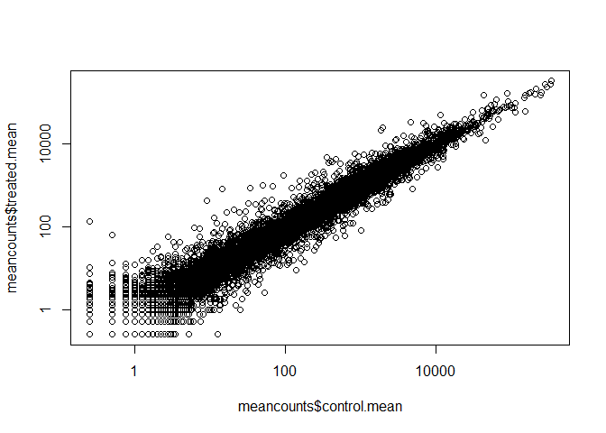
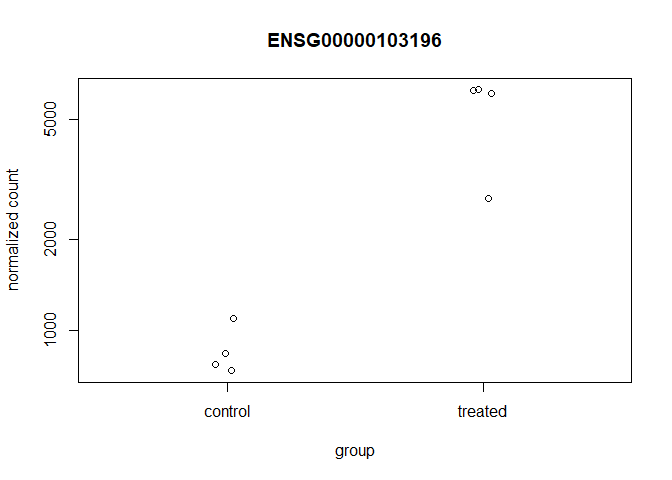
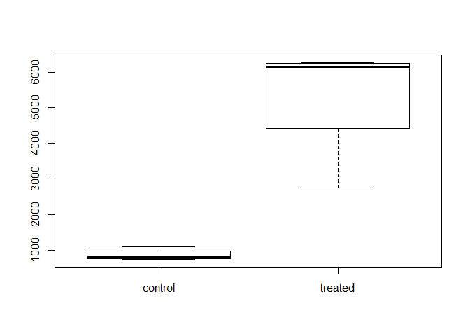
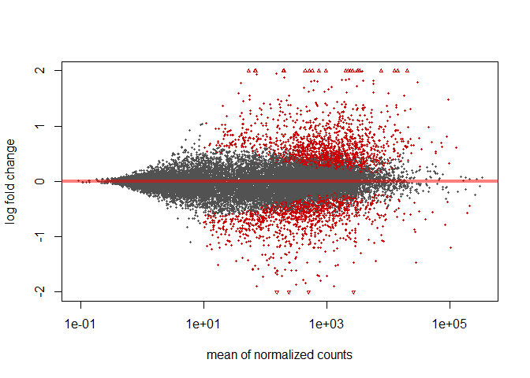
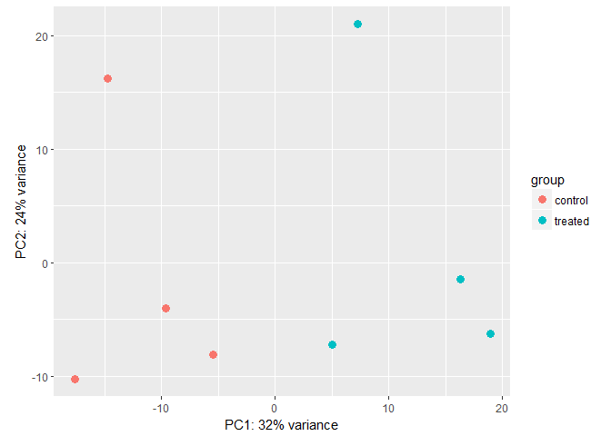

#Import countData and colData into R


```r
counts <- read.csv("airway_scaledcounts.csv", stringsAsFactors = FALSE)
metadata <-  read.csv("airway_metadata.csv", stringsAsFactors = FALSE)
```

Take a look at each

```r
head(counts)
```

```
##           ensgene SRR1039508 SRR1039509 SRR1039512 SRR1039513 SRR1039516
## 1 ENSG00000000003        723        486        904        445       1170
## 2 ENSG00000000005          0          0          0          0          0
## 3 ENSG00000000419        467        523        616        371        582
## 4 ENSG00000000457        347        258        364        237        318
## 5 ENSG00000000460         96         81         73         66        118
## 6 ENSG00000000938          0          0          1          0          2
##   SRR1039517 SRR1039520 SRR1039521
## 1       1097        806        604
## 2          0          0          0
## 3        781        417        509
## 4        447        330        324
## 5         94        102         74
## 6          0          0          0
```

```r
head(metadata)
```

```
##           id     dex celltype     geo_id
## 1 SRR1039508 control   N61311 GSM1275862
## 2 SRR1039509 treated   N61311 GSM1275863
## 3 SRR1039512 control  N052611 GSM1275866
## 4 SRR1039513 treated  N052611 GSM1275867
## 5 SRR1039516 control  N080611 GSM1275870
## 6 SRR1039517 treated  N080611 GSM1275871
```

Make sure they are the same

```r
colnames(counts)[-1] == metadata$id
```

```
## [1] TRUE TRUE TRUE TRUE TRUE TRUE TRUE TRUE
```


#Toy differential equation


```r
control <- metadata[metadata[,"dex"]=="control",]
#This gets all the control data out of the metadata file
#The "," gets the rows
control.mean <- rowSums( counts[ ,control$id] )/4 
# we are looking at control id columns, count gives the data in each id, and we are averaging
names(control.mean) <- counts$ensgene
#Add the name back for tracking
```

Q1. How would you make the above code more robust? What would happen if you were to add more samples. Would the values obtained with the excat code above be correct?
We could change the 4 when we average to the number of rows in control.

```r
control.mean <- rowSums( counts[ ,control$id] )/nrow(control) 
names(control.mean) <- counts$ensgene
head(control.mean)
```

```
## ENSG00000000003 ENSG00000000005 ENSG00000000419 ENSG00000000457 
##          900.75            0.00          520.50          339.75 
## ENSG00000000460 ENSG00000000938 
##           97.25            0.75
```

Q2. Follow the same procedure for the treated samples (i.e. calculate the mean per gene accross drug treated samples and assign to a labeled vector called treated.mean)

```r
treated <- metadata[metadata[,"dex"]=="treated",]
treated.mean <- rowSums( counts[ ,treated$id] )/nrow(treated) 
names(treated.mean) <- counts$ensgene
head(treated.mean)
```

```
## ENSG00000000003 ENSG00000000005 ENSG00000000419 ENSG00000000457 
##          658.00            0.00          546.00          316.50 
## ENSG00000000460 ENSG00000000938 
##           78.75            0.00
```

Combine into a new data frame called "mean.counts"

```r
meancounts <- data.frame(control.mean,treated.mean)
head(meancounts)
```

```
##                 control.mean treated.mean
## ENSG00000000003       900.75       658.00
## ENSG00000000005         0.00         0.00
## ENSG00000000419       520.50       546.00
## ENSG00000000457       339.75       316.50
## ENSG00000000460        97.25        78.75
## ENSG00000000938         0.75         0.00
```

number of mean reads in each group

```r
colSums(meancounts)
```

```
## control.mean treated.mean 
##     23005324     22196524
```
Q3. Create a scatter plot showing the mean of the treated samples against the mean of the control samples. Your plot should look something like the following.

```r
plot(meancounts$control.mean,meancounts$treated.mean)
```

<!-- -->

Lets change this to log axis so we can see more of our data


```r
plot(meancounts$control.mean,meancounts$treated.mean, log="xy")
```

```
## Warning in xy.coords(x, y, xlabel, ylabel, log): 15032 x values <= 0
## omitted from logarithmic plot
```

```
## Warning in xy.coords(x, y, xlabel, ylabel, log): 15281 y values <= 0
## omitted from logarithmic plot
```

<!-- -->
Here we calculate log2foldchange, add it to our meancounts data.frame and inspect the results either with the head() or the View() function for example.

```r
meancounts$log2fc <- log2(meancounts[,"treated.mean"]/meancounts[,"control.mean"])
head(meancounts)
```

```
##                 control.mean treated.mean      log2fc
## ENSG00000000003       900.75       658.00 -0.45303916
## ENSG00000000005         0.00         0.00         NaN
## ENSG00000000419       520.50       546.00  0.06900279
## ENSG00000000457       339.75       316.50 -0.10226805
## ENSG00000000460        97.25        78.75 -0.30441833
## ENSG00000000938         0.75         0.00        -Inf
```
There are a couple of “weird” results. Namely, the NaN (“not a number””) and -Inf (negative infinity) results.
 Let’s filter our data to remove these genes.

```r
zero.vals <- which(meancounts[,1:2]==0, arr.ind=TRUE)
#pick which rows are 
to.rm <- unique(zero.vals[,1])
mycounts <- meancounts[-to.rm,]
#Remove those 0
head(mycounts)
```

```
##                 control.mean treated.mean      log2fc
## ENSG00000000003       900.75       658.00 -0.45303916
## ENSG00000000419       520.50       546.00  0.06900279
## ENSG00000000457       339.75       316.50 -0.10226805
## ENSG00000000460        97.25        78.75 -0.30441833
## ENSG00000000971      5219.00      6687.50  0.35769358
## ENSG00000001036      2327.00      1785.75 -0.38194109
```

Q4. What is the purpose of the arr.ind argument in the which() function call above? Why would we then take the first column of the output and need to call the unique() function?
Test is here. arr.ind=TRUE will tell you which row and column in a matrix your data is.

```r
x<- matrix(1:10,ncol=2,byrow=TRUE)
x
```

```
##      [,1] [,2]
## [1,]    1    2
## [2,]    3    4
## [3,]    5    6
## [4,]    7    8
## [5,]    9   10
```

```r
x[5,2] <- 0
x
```

```
##      [,1] [,2]
## [1,]    1    2
## [2,]    3    4
## [3,]    5    6
## [4,]    7    8
## [5,]    9    0
```

```r
x==0
```

```
##       [,1]  [,2]
## [1,] FALSE FALSE
## [2,] FALSE FALSE
## [3,] FALSE FALSE
## [4,] FALSE FALSE
## [5,] FALSE  TRUE
```

```r
which(x==0)
```

```
## [1] 10
```

```r
which(x==0,arr.ind=TRUE)
```

```
##      row col
## [1,]   5   2
```


See what genes are up/down regulated

```r
up.ind <- mycounts$log2fc > 2
down.ind <- mycounts$log2fc < (-2)
sum(up.ind)
```

```
## [1] 250
```

```r
sum(down.ind)
```

```
## [1] 367
```

Q5. Using the up.ind and down.ind vectors above can you determine how many up and down regulated genes we have at the greater than 2 fc level?


```r
paste("Up regulated genes", sum(up.ind))
```

```
## [1] "Up regulated genes 250"
```

```r
paste("Down regulated genes", sum(down.ind))
```

```
## [1] "Down regulated genes 367"
```

#Adding annotation data

Add annotation by csv

```r
anno <- read.csv("annotables_grch38.csv")
head(anno)
```

```
##           ensgene entrez   symbol chr     start       end strand
## 1 ENSG00000000003   7105   TSPAN6   X 100627109 100639991     -1
## 2 ENSG00000000005  64102     TNMD   X 100584802 100599885      1
## 3 ENSG00000000419   8813     DPM1  20  50934867  50958555     -1
## 4 ENSG00000000457  57147    SCYL3   1 169849631 169894267     -1
## 5 ENSG00000000460  55732 C1orf112   1 169662007 169854080      1
## 6 ENSG00000000938   2268      FGR   1  27612064  27635277     -1
##          biotype
## 1 protein_coding
## 2 protein_coding
## 3 protein_coding
## 4 protein_coding
## 5 protein_coding
## 6 protein_coding
##                                                                                                  description
## 1                                                          tetraspanin 6 [Source:HGNC Symbol;Acc:HGNC:11858]
## 2                                                            tenomodulin [Source:HGNC Symbol;Acc:HGNC:17757]
## 3 dolichyl-phosphate mannosyltransferase polypeptide 1, catalytic subunit [Source:HGNC Symbol;Acc:HGNC:3005]
## 4                                               SCY1-like, kinase-like 3 [Source:HGNC Symbol;Acc:HGNC:19285]
## 5                                    chromosome 1 open reading frame 112 [Source:HGNC Symbol;Acc:HGNC:25565]
## 6                          FGR proto-oncogene, Src family tyrosine kinase [Source:HGNC Symbol;Acc:HGNC:3697]
```

Q6. From consulting the help page for the merge() function can you set the by.x and by.y arguments appropriately to annotate our mycounts data.frame with all the available annotation data in your anno data.frame?

```r
head(mycounts)
```

```
##                 control.mean treated.mean      log2fc
## ENSG00000000003       900.75       658.00 -0.45303916
## ENSG00000000419       520.50       546.00  0.06900279
## ENSG00000000457       339.75       316.50 -0.10226805
## ENSG00000000460        97.25        78.75 -0.30441833
## ENSG00000000971      5219.00      6687.50  0.35769358
## ENSG00000001036      2327.00      1785.75 -0.38194109
```

```r
head(anno)
```

```
##           ensgene entrez   symbol chr     start       end strand
## 1 ENSG00000000003   7105   TSPAN6   X 100627109 100639991     -1
## 2 ENSG00000000005  64102     TNMD   X 100584802 100599885      1
## 3 ENSG00000000419   8813     DPM1  20  50934867  50958555     -1
## 4 ENSG00000000457  57147    SCYL3   1 169849631 169894267     -1
## 5 ENSG00000000460  55732 C1orf112   1 169662007 169854080      1
## 6 ENSG00000000938   2268      FGR   1  27612064  27635277     -1
##          biotype
## 1 protein_coding
## 2 protein_coding
## 3 protein_coding
## 4 protein_coding
## 5 protein_coding
## 6 protein_coding
##                                                                                                  description
## 1                                                          tetraspanin 6 [Source:HGNC Symbol;Acc:HGNC:11858]
## 2                                                            tenomodulin [Source:HGNC Symbol;Acc:HGNC:17757]
## 3 dolichyl-phosphate mannosyltransferase polypeptide 1, catalytic subunit [Source:HGNC Symbol;Acc:HGNC:3005]
## 4                                               SCY1-like, kinase-like 3 [Source:HGNC Symbol;Acc:HGNC:19285]
## 5                                    chromosome 1 open reading frame 112 [Source:HGNC Symbol;Acc:HGNC:25565]
## 6                          FGR proto-oncogene, Src family tyrosine kinase [Source:HGNC Symbol;Acc:HGNC:3697]
```

```r
results <- merge(mycounts,anno,by.x="row.names", by.y="ensgene")
head(results)
```

```
##         Row.names control.mean treated.mean      log2fc entrez   symbol
## 1 ENSG00000000003       900.75       658.00 -0.45303916   7105   TSPAN6
## 2 ENSG00000000419       520.50       546.00  0.06900279   8813     DPM1
## 3 ENSG00000000457       339.75       316.50 -0.10226805  57147    SCYL3
## 4 ENSG00000000460        97.25        78.75 -0.30441833  55732 C1orf112
## 5 ENSG00000000971      5219.00      6687.50  0.35769358   3075      CFH
## 6 ENSG00000001036      2327.00      1785.75 -0.38194109   2519    FUCA2
##   chr     start       end strand        biotype
## 1   X 100627109 100639991     -1 protein_coding
## 2  20  50934867  50958555     -1 protein_coding
## 3   1 169849631 169894267     -1 protein_coding
## 4   1 169662007 169854080      1 protein_coding
## 5   1 196651878 196747504      1 protein_coding
## 6   6 143494811 143511690     -1 protein_coding
##                                                                                                  description
## 1                                                          tetraspanin 6 [Source:HGNC Symbol;Acc:HGNC:11858]
## 2 dolichyl-phosphate mannosyltransferase polypeptide 1, catalytic subunit [Source:HGNC Symbol;Acc:HGNC:3005]
## 3                                               SCY1-like, kinase-like 3 [Source:HGNC Symbol;Acc:HGNC:19285]
## 4                                    chromosome 1 open reading frame 112 [Source:HGNC Symbol;Acc:HGNC:25565]
## 5                                                     complement factor H [Source:HGNC Symbol;Acc:HGNC:4883]
## 6                                          fucosidase, alpha-L- 2, plasma [Source:HGNC Symbol;Acc:HGNC:4008]
```

##Another way to annotate

Bioconductor’s annotation packages help with mapping various ID schemes to each other. Here we load the AnnotationDbi package and the annotation package org.Hs.eg.db.


```r
library("AnnotationDbi")
```

```
## Loading required package: stats4
```

```
## Loading required package: BiocGenerics
```

```
## Loading required package: parallel
```

```
## 
## Attaching package: 'BiocGenerics'
```

```
## The following objects are masked from 'package:parallel':
## 
##     clusterApply, clusterApplyLB, clusterCall, clusterEvalQ,
##     clusterExport, clusterMap, parApply, parCapply, parLapply,
##     parLapplyLB, parRapply, parSapply, parSapplyLB
```

```
## The following objects are masked from 'package:stats':
## 
##     IQR, mad, sd, var, xtabs
```

```
## The following objects are masked from 'package:base':
## 
##     anyDuplicated, append, as.data.frame, cbind, colMeans,
##     colnames, colSums, do.call, duplicated, eval, evalq, Filter,
##     Find, get, grep, grepl, intersect, is.unsorted, lapply,
##     lengths, Map, mapply, match, mget, order, paste, pmax,
##     pmax.int, pmin, pmin.int, Position, rank, rbind, Reduce,
##     rowMeans, rownames, rowSums, sapply, setdiff, sort, table,
##     tapply, union, unique, unsplit, which, which.max, which.min
```

```
## Loading required package: Biobase
```

```
## Welcome to Bioconductor
## 
##     Vignettes contain introductory material; view with
##     'browseVignettes()'. To cite Bioconductor, see
##     'citation("Biobase")', and for packages 'citation("pkgname")'.
```

```
## Loading required package: IRanges
```

```
## Loading required package: S4Vectors
```

```
## 
## Attaching package: 'S4Vectors'
```

```
## The following object is masked from 'package:base':
## 
##     expand.grid
```

```r
library("org.Hs.eg.db")
```

```
## 
```
This is the organism annotation package (“org”) for Homo sapiens (“Hs”), organized as an AnnotationDbi database package (“db”), using Entrez Gene IDs (“eg”) as primary key. To get a list of all available key types, use:

```r
columns(org.Hs.eg.db)
```

```
##  [1] "ACCNUM"       "ALIAS"        "ENSEMBL"      "ENSEMBLPROT" 
##  [5] "ENSEMBLTRANS" "ENTREZID"     "ENZYME"       "EVIDENCE"    
##  [9] "EVIDENCEALL"  "GENENAME"     "GO"           "GOALL"       
## [13] "IPI"          "MAP"          "OMIM"         "ONTOLOGY"    
## [17] "ONTOLOGYALL"  "PATH"         "PFAM"         "PMID"        
## [21] "PROSITE"      "REFSEQ"       "SYMBOL"       "UCSCKG"      
## [25] "UNIGENE"      "UNIPROT"
```

Lets use the mapID function,add symbol to our "mycounts" data frame

```r
mycounts$symbol <- mapIds(org.Hs.eg.db,
                     keys=row.names(mycounts),
                     column="SYMBOL",
                     keytype="ENSEMBL",
                     multiVals="first")
```

```
## 'select()' returned 1:many mapping between keys and columns
```

```r
head(mycounts)
```

```
##                 control.mean treated.mean      log2fc   symbol
## ENSG00000000003       900.75       658.00 -0.45303916   TSPAN6
## ENSG00000000419       520.50       546.00  0.06900279     DPM1
## ENSG00000000457       339.75       316.50 -0.10226805    SCYL3
## ENSG00000000460        97.25        78.75 -0.30441833 C1orf112
## ENSG00000000971      5219.00      6687.50  0.35769358      CFH
## ENSG00000001036      2327.00      1785.75 -0.38194109    FUCA2
```
Q7. Run the mapIds() function two more times to add the Entrez ID and UniProt accession as new columns called mycounts$entrez and mycounts$uniprot. The head() of your results should look like the following:

```r
mycounts$entrez <- mapIds(org.Hs.eg.db,
                     keys=row.names(mycounts),
                     column="ENTREZID",keytype="ENSEMBL",
                     multiVals="first")
```

```
## 'select()' returned 1:many mapping between keys and columns
```

```r
mycounts$uniprot <- mapIds(org.Hs.eg.db,
                     keys=row.names(mycounts),
                     column="UNIPROT",keytype="ENSEMBL",
                     multiVals="first")
```

```
## 'select()' returned 1:many mapping between keys and columns
```

```r
head(mycounts)
```

```
##                 control.mean treated.mean      log2fc   symbol entrez
## ENSG00000000003       900.75       658.00 -0.45303916   TSPAN6   7105
## ENSG00000000419       520.50       546.00  0.06900279     DPM1   8813
## ENSG00000000457       339.75       316.50 -0.10226805    SCYL3  57147
## ENSG00000000460        97.25        78.75 -0.30441833 C1orf112  55732
## ENSG00000000971      5219.00      6687.50  0.35769358      CFH   3075
## ENSG00000001036      2327.00      1785.75 -0.38194109    FUCA2   2519
##                    uniprot
## ENSG00000000003 A0A024RCI0
## ENSG00000000419     O60762
## ENSG00000000457     Q8IZE3
## ENSG00000000460 A0A024R922
## ENSG00000000971 A0A024R962
## ENSG00000001036     Q9BTY2
```
Q8. Examine your annotated results for those genes with a log2(FoldChange) of greater than 2 (or less than -2 if you prefer) with the View() function. What do you notice? Would you trust these results? Why or why not?


```r
head(mycounts[up.ind,])
```

```
##                 control.mean treated.mean   log2fc  symbol entrez
## ENSG00000004799       270.50      1429.25 2.401558    PDK4   5166
## ENSG00000006788         2.75        19.75 2.844349   MYH13   8735
## ENSG00000008438         0.50         2.75 2.459432 PGLYRP1   8993
## ENSG00000011677         0.50         2.25 2.169925  GABRA3   2556
## ENSG00000015413         0.50         3.00 2.584963   DPEP1   1800
## ENSG00000015592         0.50         2.25 2.169925   STMN4  81551
##                    uniprot
## ENSG00000004799     A4D1H4
## ENSG00000006788     Q9UKX3
## ENSG00000008438     O75594
## ENSG00000011677     P34903
## ENSG00000015413 A0A140VJI3
## ENSG00000015592     Q9H169
```


#DESeq2 analysis

set up deseq environment

```r
library(DESeq2)
```

```
## Loading required package: GenomicRanges
```

```
## Loading required package: GenomeInfoDb
```

```
## Loading required package: SummarizedExperiment
```

```
## Loading required package: DelayedArray
```

```
## Loading required package: matrixStats
```

```
## 
## Attaching package: 'matrixStats'
```

```
## The following objects are masked from 'package:Biobase':
## 
##     anyMissing, rowMedians
```

```
## 
## Attaching package: 'DelayedArray'
```

```
## The following objects are masked from 'package:matrixStats':
## 
##     colMaxs, colMins, colRanges, rowMaxs, rowMins, rowRanges
```

```
## The following object is masked from 'package:base':
## 
##     apply
```

```r
citation("DESeq2")
```

```
## 
##   Love, M.I., Huber, W., Anders, S. Moderated estimation of fold
##   change and dispersion for RNA-seq data with DESeq2 Genome
##   Biology 15(12):550 (2014)
## 
## A BibTeX entry for LaTeX users is
## 
##   @Article{,
##     title = {Moderated estimation of fold change and dispersion for RNA-seq data with DESeq2},
##     author = {Michael I. Love and Wolfgang Huber and Simon Anders},
##     year = {2014},
##     journal = {Genome Biology},
##     doi = {10.1186/s13059-014-0550-8},
##     volume = {15},
##     issue = {12},
##     pages = {550},
##   }
```

Importing data


```r
dds <- DESeqDataSetFromMatrix(countData=counts, 
                              colData=metadata, 
                              design=~dex, 
                              tidy=TRUE)
```

```
## converting counts to integer mode
```

```
## Warning in DESeqDataSet(se, design = design, ignoreRank): some variables in
## design formula are characters, converting to factors
```

```r
dds
```

```
## class: DESeqDataSet 
## dim: 38694 8 
## metadata(1): version
## assays(1): counts
## rownames(38694): ENSG00000000003 ENSG00000000005 ...
##   ENSG00000283120 ENSG00000283123
## rowData names(0):
## colnames(8): SRR1039508 SRR1039509 ... SRR1039520 SRR1039521
## colData names(4): id dex celltype geo_id
```

#DESeq pipeline


```r
dds <- DESeq(dds)
```

```
## estimating size factors
```

```
## estimating dispersions
```

```
## gene-wise dispersion estimates
```

```
## mean-dispersion relationship
```

```
## final dispersion estimates
```

```
## fitting model and testing
```

```r
res <- results(dds)

res
```

```
## log2 fold change (MLE): dex treated vs control 
## Wald test p-value: dex treated vs control 
## DataFrame with 38694 rows and 6 columns
##                  baseMean log2FoldChange     lfcSE       stat     pvalue
##                 <numeric>      <numeric> <numeric>  <numeric>  <numeric>
## ENSG00000000003 747.19420    -0.35070283 0.1682342 -2.0846111 0.03710462
## ENSG00000000005   0.00000             NA        NA         NA         NA
## ENSG00000000419 520.13416     0.20610652 0.1010134  2.0403876 0.04131173
## ENSG00000000457 322.66484     0.02452714 0.1451103  0.1690242 0.86577762
## ENSG00000000460  87.68263    -0.14714409 0.2569657 -0.5726216 0.56690095
## ...                   ...            ...       ...        ...        ...
## ENSG00000283115  0.000000             NA        NA         NA         NA
## ENSG00000283116  0.000000             NA        NA         NA         NA
## ENSG00000283119  0.000000             NA        NA         NA         NA
## ENSG00000283120  0.974916     -0.6682308  1.694063 -0.3944544  0.6932456
## ENSG00000283123  0.000000             NA        NA         NA         NA
##                      padj
##                 <numeric>
## ENSG00000000003 0.1630257
## ENSG00000000005        NA
## ENSG00000000419 0.1757326
## ENSG00000000457 0.9616577
## ENSG00000000460 0.8157061
## ...                   ...
## ENSG00000283115        NA
## ENSG00000283116        NA
## ENSG00000283119        NA
## ENSG00000283120        NA
## ENSG00000283123        NA
```


```r
summary(res)
```

```
## 
## out of 25258 with nonzero total read count
## adjusted p-value < 0.1
## LFC > 0 (up)     : 1564, 6.2% 
## LFC < 0 (down)   : 1188, 4.7% 
## outliers [1]     : 142, 0.56% 
## low counts [2]   : 9971, 39% 
## (mean count < 10)
## [1] see 'cooksCutoff' argument of ?results
## [2] see 'independentFiltering' argument of ?results
```

We can order our results table by the smallest p value:


```r
resOrdered <- res[order(res$pvalue),]
head(resOrdered)
```

```
## log2 fold change (MLE): dex treated vs control 
## Wald test p-value: dex treated vs control 
## DataFrame with 6 rows and 6 columns
##                   baseMean log2FoldChange      lfcSE      stat
##                  <numeric>      <numeric>  <numeric> <numeric>
## ENSG00000152583   954.7709       4.368359 0.23713648  18.42129
## ENSG00000179094   743.2527       2.863888 0.17555825  16.31304
## ENSG00000116584  2277.9135      -1.034700 0.06505273 -15.90556
## ENSG00000189221  2383.7537       3.341544 0.21241508  15.73120
## ENSG00000120129  3440.7038       2.965211 0.20370277  14.55656
## ENSG00000148175 13493.9204       1.427168 0.10036663  14.21955
##                       pvalue         padj
##                    <numeric>    <numeric>
## ENSG00000152583 8.867079e-76 1.342919e-71
## ENSG00000179094 7.972621e-60 6.037268e-56
## ENSG00000116584 5.798513e-57 2.927283e-53
## ENSG00000189221 9.244206e-56 3.500088e-52
## ENSG00000120129 5.306416e-48 1.607313e-44
## ENSG00000148175 6.929711e-46 1.749175e-42
```
By default the argument alpha is set to 0.1. If the adjusted p value cutoff will be a value other than 0.1, alpha should be set to that value:

```r
res05 <- results(dds, alpha=0.05)
summary(res05)
```

```
## 
## out of 25258 with nonzero total read count
## adjusted p-value < 0.05
## LFC > 0 (up)     : 1237, 4.9% 
## LFC < 0 (down)   : 933, 3.7% 
## outliers [1]     : 142, 0.56% 
## low counts [2]   : 9033, 36% 
## (mean count < 6)
## [1] see 'cooksCutoff' argument of ?results
## [2] see 'independentFiltering' argument of ?results
```


Q9. How many are significant with an adjusted p-value < 0.05? How about 0.01? Save this last set of results as resSig01.

```r
resSig05 <- subset(as.data.frame(res), padj < 0.05)
nrow(resSig05)
```

```
## [1] 2182
```

```r
resSig01 <- subset(as.data.frame(res), padj < 0.01)
nrow(resSig01)
```

```
## [1] 1437
```
Q10. Using either the previously generated anno object (annotations from the file annotables_grch38.csv file) or the mapIds() function (from the AnnotationDbi package) add annotation to your res01 results data.frame.

```r
resSig01$symbol <- mapIds(org.Hs.eg.db,
                     keys=row.names(resSig01),
                     column="SYMBOL",
                     keytype="ENSEMBL",
                     multiVals="first")
```

```
## 'select()' returned 1:many mapping between keys and columns
```

```r
head(resSig01)
```

```
##                  baseMean log2FoldChange      lfcSE      stat       pvalue
## ENSG00000002834 8609.1828      0.4168750 0.10827683  3.850085 1.180767e-04
## ENSG00000003096  414.0753     -0.9645789 0.19172945 -5.030937 4.880878e-07
## ENSG00000003402 3368.7234      1.1624996 0.12612244  9.217230 3.048738e-20
## ENSG00000004059 1684.3218      0.3796901 0.11417088  3.325630 8.821899e-04
## ENSG00000004487 1255.8003     -0.3341069 0.09600563 -3.480076 5.012723e-04
## ENSG00000004700 1510.2085      0.4095532 0.11914030  3.437570 5.869579e-04
##                         padj symbol
## ENSG00000002834 1.824767e-03  LASP1
## ENSG00000003096 1.490341e-05 KLHL13
## ENSG00000003402 7.859356e-18  CFLAR
## ENSG00000004059 9.389154e-03   ARF5
## ENSG00000004487 6.006146e-03  KDM1A
## ENSG00000004700 6.760059e-03  RECQL
```


You can arrange and view the results by the adjusted p-value


```r
ord <- order( resSig01$padj )
#View(res01[ord,])
head(resSig01[ord,])
```

```
##                   baseMean log2FoldChange      lfcSE      stat
## ENSG00000152583   954.7709       4.368359 0.23713648  18.42129
## ENSG00000179094   743.2527       2.863888 0.17555825  16.31304
## ENSG00000116584  2277.9135      -1.034700 0.06505273 -15.90556
## ENSG00000189221  2383.7537       3.341544 0.21241508  15.73120
## ENSG00000120129  3440.7038       2.965211 0.20370277  14.55656
## ENSG00000148175 13493.9204       1.427168 0.10036663  14.21955
##                       pvalue         padj  symbol
## ENSG00000152583 8.867079e-76 1.342919e-71 SPARCL1
## ENSG00000179094 7.972621e-60 6.037268e-56    PER1
## ENSG00000116584 5.798513e-57 2.927283e-53 ARHGEF2
## ENSG00000189221 9.244206e-56 3.500088e-52    MAOA
## ENSG00000120129 5.306416e-48 1.607313e-44   DUSP1
## ENSG00000148175 6.929711e-46 1.749175e-42    STOM
```
Finally, let’s write out the ordered significant results with annotations. See the help for ?write.csv if you are unsure here.

```r
write.csv(resSig01[ord,], "signif01_results.csv")
```

#Data visualization

##Plotting counts

Let’s first see what the gene ID is for the CRISPLD2 gene using:

```r
i <- grep("CRISPLD2", resSig01$symbol)
resSig01[i,]
```

```
##                 baseMean log2FoldChange     lfcSE     stat       pvalue
## ENSG00000103196 3096.159       2.626034 0.2674705 9.818031 9.416441e-23
##                         padj   symbol
## ENSG00000103196 3.395524e-20 CRISPLD2
```

```r
rownames(resSig01[i,])
```

```
## [1] "ENSG00000103196"
```

Now, with that gene ID in hand let’s plot the counts, where our intgroup, or “interesting group” variable is the “dex” column.

```r
plotCounts(dds, gene="ENSG00000103196", intgroup="dex")
```

<!-- -->

```r
# Return the data
d <- plotCounts(dds, gene="ENSG00000103196", intgroup="dex", returnData=TRUE)
head(d)
```

```
##                count     dex
## SRR1039508  774.5002 control
## SRR1039509 6258.7915 treated
## SRR1039512 1100.2741 control
## SRR1039513 6093.0324 treated
## SRR1039516  736.9483 control
## SRR1039517 2742.1908 treated
```


```r
boxplot(count ~ dex , data=d)
```

<!-- -->


```r
library(ggplot2)
ggplot(d, aes(dex, count)) + geom_boxplot(aes(fill=dex)) + scale_y_log10() + ggtitle("CRISPLD2")
```

<!-- -->

##MA & Volcano plots


```r
res$sig <- res$padj<0.05

# How many of each?
table(res$sig)
```

```
## 
## FALSE  TRUE 
## 12963  2182
```


```r
sum(is.na(res$sig))
```

```
## [1] 23549
```


```r
plotMA(res, ylim=c(-2,2))
```

<!-- -->


```r
resLFC <- lfcShrink(dds, coef=2)
resLFC
```

```
## log2 fold change (MAP): dex treated vs control 
## Wald test p-value: dex treated vs control 
## DataFrame with 38694 rows and 6 columns
##                  baseMean log2FoldChange      lfcSE       stat     pvalue
##                 <numeric>      <numeric>  <numeric>  <numeric>  <numeric>
## ENSG00000000003 747.19420    -0.31838595 0.15271739 -2.0846111 0.03710462
## ENSG00000000005   0.00000             NA         NA         NA         NA
## ENSG00000000419 520.13416     0.19883048 0.09744556  2.0403876 0.04131173
## ENSG00000000457 322.66484     0.02280238 0.13491699  0.1690242 0.86577762
## ENSG00000000460  87.68263    -0.11887370 0.20772938 -0.5726216 0.56690095
## ...                   ...            ...        ...        ...        ...
## ENSG00000283115  0.000000             NA         NA         NA         NA
## ENSG00000283116  0.000000             NA         NA         NA         NA
## ENSG00000283119  0.000000             NA         NA         NA         NA
## ENSG00000283120  0.974916    -0.05944174  0.1514839 -0.3944544  0.6932456
## ENSG00000283123  0.000000             NA         NA         NA         NA
##                      padj
##                 <numeric>
## ENSG00000000003 0.1630257
## ENSG00000000005        NA
## ENSG00000000419 0.1757326
## ENSG00000000457 0.9616577
## ENSG00000000460 0.8157061
## ...                   ...
## ENSG00000283115        NA
## ENSG00000283116        NA
## ENSG00000283119        NA
## ENSG00000283120        NA
## ENSG00000283123        NA
```


```r
plotMA(resLFC, ylim=c(-2,2))
```

<!-- -->


##volcano plot

```r
ggplot(as.data.frame(res), aes(log2FoldChange, -1*log10(pvalue), col=sig)) + 
    geom_point() + 
    ggtitle("Volcano plot")
```

```
## Warning: Removed 13578 rows containing missing values (geom_point).
```

<!-- -->


```r
vsdata <- vst(dds, blind=FALSE)
plotPCA(vsdata, intgroup="dex")
```

<!-- -->


```r
sessionInfo()
```

```
## R version 3.4.4 (2018-03-15)
## Platform: x86_64-w64-mingw32/x64 (64-bit)
## Running under: Windows 10 x64 (build 16299)
## 
## Matrix products: default
## 
## locale:
## [1] LC_COLLATE=English_United States.1252 
## [2] LC_CTYPE=English_United States.1252   
## [3] LC_MONETARY=English_United States.1252
## [4] LC_NUMERIC=C                          
## [5] LC_TIME=English_United States.1252    
## 
## attached base packages:
## [1] parallel  stats4    stats     graphics  grDevices utils     datasets 
## [8] methods   base     
## 
## other attached packages:
##  [1] ggplot2_2.2.1              DESeq2_1.18.1             
##  [3] SummarizedExperiment_1.8.1 DelayedArray_0.4.1        
##  [5] matrixStats_0.53.1         GenomicRanges_1.30.3      
##  [7] GenomeInfoDb_1.14.0        org.Hs.eg.db_3.5.0        
##  [9] AnnotationDbi_1.40.0       IRanges_2.12.0            
## [11] S4Vectors_0.16.0           Biobase_2.38.0            
## [13] BiocGenerics_0.24.0       
## 
## loaded via a namespace (and not attached):
##  [1] locfit_1.5-9.1         Rcpp_0.12.16           lattice_0.20-35       
##  [4] rprojroot_1.3-2        digest_0.6.15          plyr_1.8.4            
##  [7] backports_1.1.2        acepack_1.4.1          RSQLite_2.1.0         
## [10] evaluate_0.10.1        pillar_1.2.1           zlibbioc_1.24.0       
## [13] rlang_0.2.0            lazyeval_0.2.1         annotate_1.56.2       
## [16] rstudioapi_0.7         data.table_1.11.2      blob_1.1.1            
## [19] rpart_4.1-13           Matrix_1.2-14          checkmate_1.8.5       
## [22] rmarkdown_1.9          labeling_0.3           splines_3.4.4         
## [25] BiocParallel_1.12.0    geneplotter_1.56.0     stringr_1.3.0         
## [28] foreign_0.8-70         htmlwidgets_1.2        RCurl_1.95-4.10       
## [31] bit_1.1-12             munsell_0.4.3          compiler_3.4.4        
## [34] pkgconfig_2.0.1        base64enc_0.1-3        htmltools_0.3.6       
## [37] nnet_7.3-12            tibble_1.4.2           gridExtra_2.3         
## [40] htmlTable_1.11.2       GenomeInfoDbData_1.0.0 Hmisc_4.1-1           
## [43] XML_3.98-1.11          bitops_1.0-6           grid_3.4.4            
## [46] xtable_1.8-2           gtable_0.2.0           DBI_0.8               
## [49] magrittr_1.5           scales_0.5.0           stringi_1.1.7         
## [52] XVector_0.18.0         genefilter_1.60.0      latticeExtra_0.6-28   
## [55] Formula_1.2-3          RColorBrewer_1.1-2     tools_3.4.4           
## [58] bit64_0.9-7            survival_2.42-3        yaml_2.1.18           
## [61] colorspace_1.3-2       cluster_2.0.7-1        memoise_1.1.0         
## [64] knitr_1.20
```

